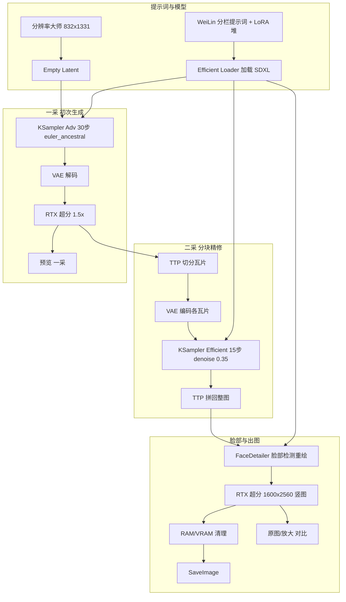

# 究极参考流 — 工作流说明

> 对应 API 工作流文件：`CustomProject/workflows/variants/究极参考流.json`  
> 格式：ComfyUI **API 导出**（节点 id 为数字字符串）  
> 最后分析日期：2026-05-24

---

## 一句话总结

这是一条面向 **Illustrious / SDXL 竖图** 的「分模块 WeiLin 提示词 + 多 LoRA + 双阶段采样 + 分块二采 + 脸部精修 + RTX 超分 + 显存清理」的完整出图流水线。  
**包含**：文生图、提示词管理、分块局部重绘式精修、脸部局部增强、超分辨率、内存回收。  
**不包含**：经典「手动画蒙版 Inpaint」节点（如 `InpaintModelConditioning` + 蒙版编辑器），但 **FaceDetailer** 与 **TTP 分块二采** 属于局部/分块级别的再生成。

---

## 你的判断对照

| 功能 | 是否具备 | 本工作流中的实现 |
|------|----------|------------------|
| 图片生成（文生图） | ✅ | `Efficient Loader` + `EmptyLatentImage` + `KSampler` |
| 缓存/显存回收 | ✅（内存清理，非 ComfyUI 执行缓存） | `RAMCleanup`、`VRAMCleanup`、`easy cleanGpuUsed` |
| 提示词管理 | ✅ | 多个 `WeiLinPromptUI*` 节点分栏编辑、链式合并 |
| 局部重绘 | ⚠️ 部分具备 | **TTP 分块二采**（整图分块 img2img）+ **FaceDetailer**（脸部检测后局部重绘） |
| 高清放大 | ✅ | `RTXVideoSuperResolution`（需 RTX GPU） |
| 对比预览 | ✅ | `Image Comparer (rgthree)` |

---

## 依赖插件 / 节点包（使用前请确认已安装）

| 节点类型 | 常见来源 |
|----------|----------|
| `Efficient Loader` / `KSampler (Efficient)` / `KSampler Adv. (Efficient)` | Efficiency Nodes 或同类效率节点包 |
| `WeiLinPromptUIWithoutLora` / `WeiLinPromptUIOnlyLoraStack` | **WeiLin-Comfyui-Tools** |
| `FaceDetailer` + `UltralyticsDetectorProvider` | **ComfyUI Impact Pack**（或含 FaceDetailer 的扩展） |
| `TTP_*` 分块节点 | **TTP** 分块工具扩展 |
| `RTXVideoSuperResolution` | **Nvidia RTX Nodes**（仅 RTX 显卡） |
| `ResolutionMasterSimplify` | 分辨率大师相关扩展 |
| `RAMCleanup` / `VRAMCleanup` | 显存清理类自定义节点 |
| `CR Seed` | Comfyroll 等节点包 |
| `easy float` / `easy cleanGpuUsed` | ComfyUI Easy Use |
| `Image Comparer (rgthree)` | rgthree ComfyUI |

---

## 默认模型与分辨率

| 项目 | 工作流内配置 |
|------|----------------|
| Checkpoint | `waiIllustriousSDXL_v170.safetensors` |
| VAE | Baked VAE（随 Checkpoint） |
| CLIP Skip | -2 |
| 初始分辨率 | `ResolutionMasterSimplify` → 约 **832 × 1331**（竖图） |
| 种子 | `CR Seed`（示例 seed: 922） |

---

## 提示词体系（WeiLin 分栏）

提示词按 **模块串联**（每个模块一个 `WeiLinPromptUIWithoutLora`），通过 `opt_text` / `opt_clip` 接到下一模块，最终汇入正/负向 conditioning。

建议理解顺序（从底到顶合并）：

| 节点标题 | 作用 |
|----------|------|
| **画质** | 质量词、画风、脚部和景深等通用正向词 |
| **皮肤** | 皮肤质感相关 tag |
| **简洁背景** | 透明/白底、无阴影等背景控制 |
| **构图** | 镜头、姿势强度、画风 token（如 c7ilf） |
| **人物** | 角色外貌、发色、服装基础等 |
| **服装** | 鞋袜、脸红等服饰细节 |
| **姿势** | 具体动作、视角、表情 |
| **正面** | 链末端，汇总正向提示（节点 382） |
| **负面** | 独立负面模块（节点 365）：lazyneg、低质量、肢体错误、脚部问题等 |

### LoRA

| 节点 | 作用 |
|------|------|
| **WeiLin Lora堆** (`WeiLinPromptUIOnlyLoraStack`) | 多 LoRA 堆叠（示例含 lazypos、nyalia、画风、皮肤等，权重在 JSON 内） |
| **加载LoRA** (`LoraLoader`) | 额外加载 `lazypos.safetensors`（强度 1） |

在 ComfyUI 中改提示词：点开对应 **WeiLin 提示词 UI** 节点；改 LoRA：编辑 **Lora堆** 或 **加载LoRA**。

---

## 处理流水线（执行顺序）

### 阶段说明

#### 1. 初次文生图（一采）

- **KSampler Adv. (Efficient)**：约 30 步，`euler_ancestral`，CFG 来自浮点数节点（示例 5）
- 输出 latent 解码为图 → **RTX Video Super Resolution**（按倍数 1.5 放大）→ 预览节点 **「一采」**

#### 2. 分块二采（TTP，类似整图局部重绘）

对一采放大后的图：

1. `TTP_Tile_image_size`：按 2×2 因子、15% overlap 计算瓦片
2. `TTP_Image_Tile_Batch`：切成多块
3. 每块 **VAE Encode** → **KSampler (Efficient)**：`denoise=0.35`，15 步，`exponential` 调度（在放大图上做 img2img 式细化）
4. `TTP_Image_Assy`：拼回完整图（padding 128）

这是 **分块高清修复**，不是单区域蒙版 inpaint，但效果上属于「整图分区重绘」。

#### 3. 脸部局部增强（FaceDetailer）

- 检测器：`bbox/yolov8m-seg.pt`（Ultralytics）
- 对 **脸** 区域：`denoise=0.3`，30 步，带 bbox 扩展与 SAM 相关参数
- 输入为二采拼回后的图（节点 291 → 88）

#### 4. 最终超分与出图

- **RTX Video Super Resolution**：目标约 **1600×2560**，质量 ULTRA（节点「竖图」）

### 为什么是「两次 RTX」？修脸为何在二采之后？

| 步骤 | 作用 |
|------|------|
| **第一次 RTX（1.5×）** | 中间高清放大：一采分辨率偏低，先放大再 TTP 二采，分块 img2img 有更多像素可细化。 |
| **TTP 二采** | 整图分区再画，脸可能被柔化或略糊。 |
| **FaceDetailer** | 在「已细化、未最终放大」的图上只修脸，避免一采小脸糊；也避免先放大到 1600 再修脸（框更大、更吃显存）。 |
| **第二次 RTX（1600×2560）** | **交付用**最终尺寸超分，不是重复第一步，而是输出竖图成品。 |

**超分** = 超分辨率 / 高清放大；本流使用 **RTX Video Super Resolution**（需 RTX 显卡），与单纯 Lanczos 缩放不同，会由模型补充细节。
- **RAM-Cleanup** → **VRAM-Cleanup** → **清理显存占用**
- **SaveImage** 保存最终结果
- **Image Comparer**：对比「原图/高清放大」前后（FaceDetailer 前 RTX1 图 vs 最终竖图）

---

## 关键参数速查（改图时最常动）

| 节点 | 参数 | 示例值 | 说明 |
|------|------|--------|------|
| 底图 `CR Seed` | seed | 922 | 随机种子 |
| 浮点数 | value | 5 | 一采 CFG |
| KSampler Adv | steps | 30 | 一采步数 |
| KSampler (Efficient) 二采 | denoise | 0.35 | 越大改动越大 |
| KSampler (Efficient) 二采 | steps | 15 | 二采步数 |
| RTX（一采后） | scale | 1.5 | 第一次放大倍数 |
| RTX（最终竖图） | width×height | 1600×2560 | 最终输出尺寸 |
| FaceDetailer | denoise | 0.3 | 脸部重绘强度 |
| 分辨率大师 | width×height | 832×1331 | 初始生成分辨率 |

---

## 与 CustomProject 控制台的关系

- 本文件位于 `workflows/variants/`，属于 **子工作流变体**，不是母版 `First_api.json`。
- 若要在 CustomProject 里用 API 提交，需确认 `editable_config.json` 是否映射了本变体中的 Efficiency / WeiLin 节点；**大量自定义节点无法通过 CustomProject 简化表单完整配置**，通常需在 **ComfyUI 原生界面** 打开此 JSON 运行或维护。
- CustomProject 擅长：Checkpoint/LoRA 列表、批量扫参、历史记录等；**WeiLin 提示词 UI 仅在 ComfyUI 图编辑器内编辑**。

---

## 使用检查清单（下次打开前）

- [ ] ComfyUI 已启动，且已安装上表全部扩展
- [ ] Checkpoint `waiIllustriousSDXL_v170.safetensors` 与 JSON 中 LoRA 文件存在于 `models/` 对应目录
- [ ] RTX 超分节点可用（NVIDIA RTX + `nvidia-vfx` / RTX Nodes 插件）
- [ ] 显存建议：分块二采 + FaceDetailer 显存占用较高，不足时可降低分辨率或关闭 FaceDetailer 试跑
- [ ] 在 ComfyUI 加载 `究极参考流.json`，先改 **WeiLin 分栏提示词** 与 **种子**，再 Queue Prompt
- [ ] 需要对比效果时看 **Image Comparer** 节点输出

---

## 常见问题

**Q：算不算「局部重绘」？**  
A：算「分区/分部位」层面的重绘：TTP 按瓦片整图二采 + FaceDetailer 只修脸；没有通用蒙版 Inpaint 工作流。

**Q：缓存回收指什么？**  
A：指工作流末尾的 **RAM/VRAM 清理** 与 `cleanGpuUsed`，用于释放内存/显存，避免 OOM；不是 ComfyUI 的节点输出缓存复用。

**Q：能否只用一采不出二采？**  
A：可以，但需改连线：让保存节点接在「一采」预览图之后，并跳过 TTP/FaceDetailer 链（或把二采 denoise 调很低）。

**Q：为什么 CustomProject 里可能无法一键跑通？**  
A：依赖 WeiLin UI、Efficiency、Impact、TTP、RTX 等自定义节点；CustomProject 默认工作流若未包含这些节点的 API 映射，请直接在 ComfyUI 运行本 JSON。

---

## 节点清单（按 class_type）

| class_type | 数量 | 用途简述 |
|------------|------|----------|
| WeiLinPromptUIWithoutLora | 10 | 分栏提示词 |
| WeiLinPromptUIOnlyLoraStack | 1 | LoRA 堆 |
| Efficient Loader | 1 | 模型/CLIP/VAE 一体加载 |
| KSampler Adv. (Efficient) | 1 | 一采 |
| KSampler (Efficient) | 1 | 二采 |
| RTXVideoSuperResolution | 2 | 两次超分 |
| TTP_Tile_image_size / TTP_Image_Tile_Batch / TTP_Image_Assy | 各 1 | 分块与拼接 |
| FaceDetailer | 1 | 脸部修复 |
| UltralyticsDetectorProvider | 1 | 人脸检测 |
| RAMCleanup | 2 | 内存清理 |
| VRAMCleanup | 2 | 显存卸载 |
| VAEDecode / VAEEncode | 各 2 | 编解码 |
| ResolutionMasterSimplify | 1 | 分辨率 |
| 其它 | 若干 | 预览、保存、种子、对比、浮点参数等 |

---

*文档由工作流 JSON 自动梳理生成，若你在 ComfyUI 中改过连线或节点标题，以实际画布为准。*
